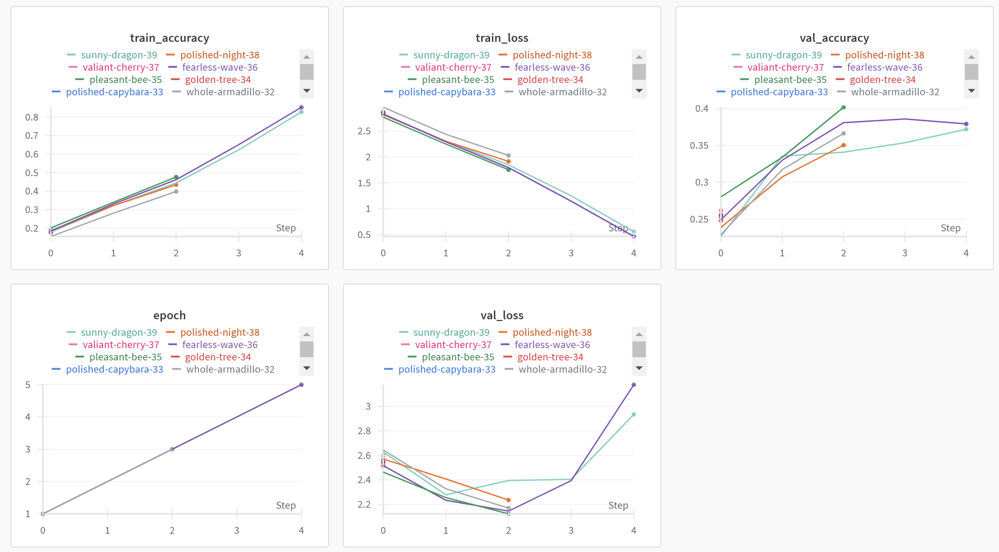
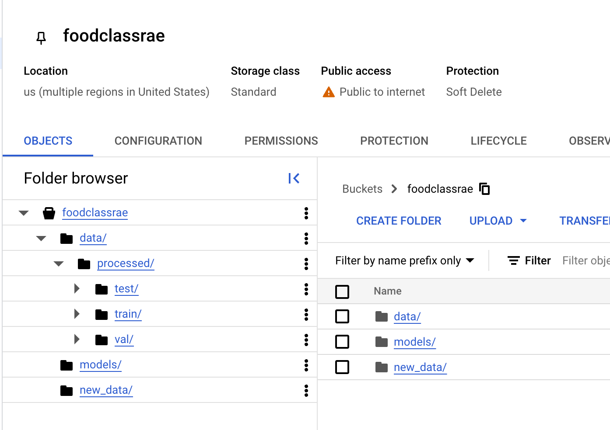
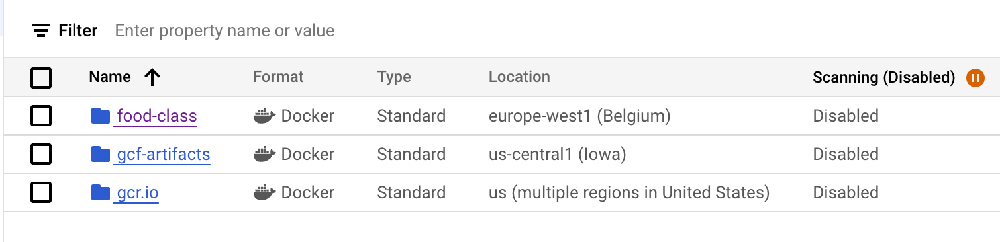
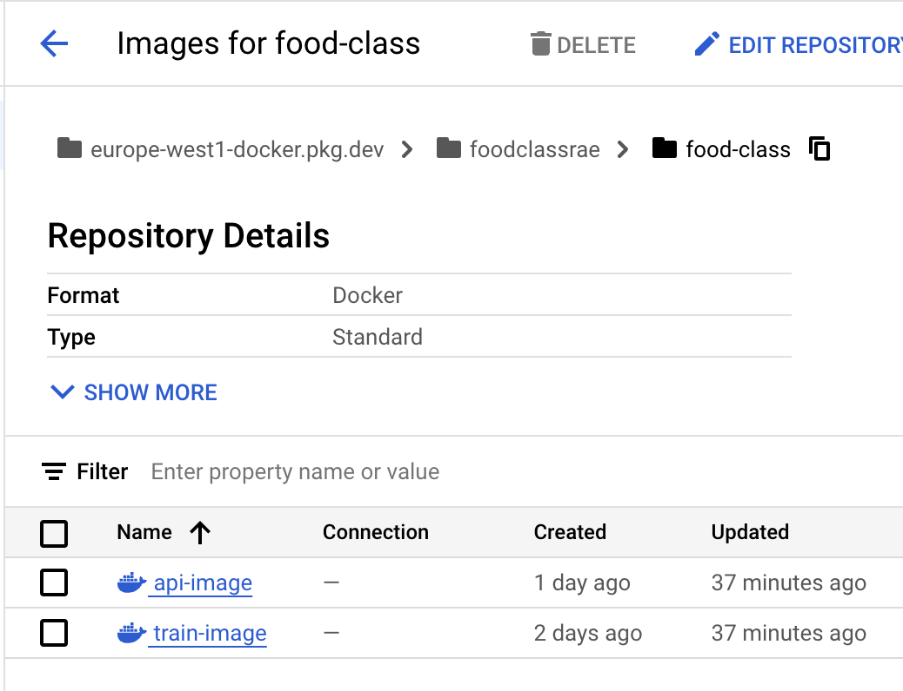
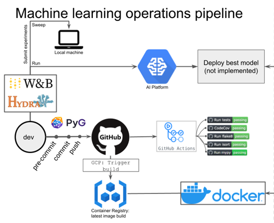

# Exam template for 02476 Machine Learning Operations

This is the report template for the exam. Please only remove the text formatted as with three dashes in front and behind
like:

```--- question 1 fill here ---```

Where you instead should add your answers. Any other changes may have unwanted consequences when your report is
auto-generated at the end of the course. For questions where you are asked to include images, start by adding the image
to the `figures` subfolder (please only use `.png`, `.jpg` or `.jpeg`) and then add the following code in your answer:

```markdown

```

In addition to this markdown file, we also provide the `report.py` script that provides two utility functions:

Running:

```bash
python report.py html
```

Will generate a `.html` page of your report. After the deadline for answering this template, we will auto-scrape
everything in this `reports` folder and then use this utility to generate a `.html` page that will be your serve
as your final hand-in.

Running

```bash
python report.py check
```

Will check your answers in this template against the constraints listed for each question e.g. is your answer too
short, too long, or have you included an image when asked. For both functions to work you mustn't rename anything.
The script has two dependencies that can be installed with

```bash
pip install typer markdown
```

## Overall project checklist

The checklist is *exhaustive* which means that it includes everything that you could do on the project included in the
curriculum in this course. Therefore, we do not expect at all that you have checked all boxes at the end of the project.
The parenthesis at the end indicates what module the bullet point is related to. Please be honest in your answers, we
will check the repositories and the code to verify your answers.

### Week 1

* [X] Create a git repository (M5)
* [X] Make sure that all team members have write access to the GitHub repository (M5)
* [X] Create a dedicated environment for you project to keep track of your packages (M2)
* [X] Create the initial file structure using cookiecutter with an appropriate template (M6)
* [X] Fill out the `data.py` file such that it downloads whatever data you need and preprocesses it (if necessary) (M6)
* [X] Add a model to `model.py` and a training procedure to `train.py` and get that running (M6)
* [X] Remember to fill out the `requirements.txt` and `requirements_dev.txt` file with whatever dependencies that you
    are using (M2+M6)
* [X] Remember to comply with good coding practices (`pep8`) while doing the project (M7)
* [X] Do a bit of code typing and remember to document essential parts of your code (M7)
* [X] Setup version control for your data or part of your data (M8)
* [ ] Add command line interfaces and project commands to your code where it makes sense (M9)
* [X] Construct one or multiple docker files for your code (M10)
* [X] Build the docker files locally and make sure they work as intended (M10)
* [X] Write one or multiple configurations files for your experiments (M11)
* [ ] Used Hydra to load the configurations and manage your hyperparameters (M11)
* [X] Use profiling to optimize your code (M12)
* [ ] Use logging to log important events in your code (M14)
* [X] Use Weights & Biases to log training progress and other important metrics/artifacts in your code (M14)
* [X] Consider running a hyperparameter optimization sweep (M14)
* [ ] Use PyTorch-lightning (if applicable) to reduce the amount of boilerplate in your code (M15)

### Week 2

* [X] Write unit tests related to the data part of your code (M16)
* [X] Write unit tests related to model construction and or model training (M16)
* [X] Calculate the code coverage (M16)
* [X] Get some continuous integration running on the GitHub repository (M17)
* [ ] Add caching and multi-os/python/pytorch testing to your continuous integration (M17)
* [X] Add a linting step to your continuous integration (M17)
* [ ] Add pre-commit hooks to your version control setup (M18)
* [X] Add a continues workflow that triggers when data changes (M19)
* [ ] Add a continues workflow that triggers when changes to the model registry is made (M19)
* [X] Create a data storage in GCP Bucket for your data and link this with your data version control setup (M21)
* [X] Create a trigger workflow for automatically building your docker images (M21)
* [X] Get your model training in GCP using either the Engine or Vertex AI (M21)
* [X] Create a FastAPI application that can do inference using your model (M22)
* [X] Deploy your model in GCP using either Functions or Run as the backend (M23)
* [X] Write API tests for your application and setup continues integration for these (M24)
* [X] Load test your application (M24)
* [ ] Create a more specialized ML-deployment API using either ONNX or BentoML, or both (M25)
* [X] Create a frontend for your API (M26)

### Week 3

* [X] Check how robust your model is towards data drifting (M27)
* [ ] Deploy to the cloud a drift detection API (M27)
* [X] Instrument your API with a couple of system metrics (M28)
* [X] Setup cloud monitoring of your instrumented application (M28)
* [X] Create one or more alert systems in GCP to alert you if your app is not behaving correctly (M28)
* [ ] If applicable, optimize the performance of your data loading using distributed data loading (M29)
* [ ] If applicable, optimize the performance of your training pipeline by using distributed training (M30)
* [ ] Play around with quantization, compilation and pruning for you trained models to increase inference speed (M31)

### Extra

* [ ] Write some documentation for your application (M32)
* [ ] Publish the documentation to GitHub Pages (M32)
* [X] Revisit your initial project description. Did the project turn out as you wanted?
* [ ] Create an architectural diagram over your MLOps pipeline
* [X] Make sure all group members have an understanding about all parts of the project
* [X] Uploaded all your code to GitHub

## Group information

### Question 1
> **Enter the group number you signed up on <learn.inside.dtu.dk>**
>
> Answer:

75

### Question 2
> **Enter the study number for each member in the group**
>
> Example:
>
> *sXXXXXX, sXXXXXX, sXXXXXX*
>
> Answer:

s234800, s234846, s223750

### Question 3
> **A requirement to the project is that you include a third-party package not covered in the course. What framework**
> **did you choose to work with and did it help you complete the project?**
>
> Recommended answer length: 100-200 words.
>
> Example:
> *We used the third-party framework ... in our project. We used functionality ... and functionality ... from the*
> *package to do ... and ... in our project*.
>
> Answer:

We used the third-party framework Gradio in our project. We utilized the Interface class from Gradio to create an interactive web interface for our API. Gradio allowed us to easily set up an interface where users can upload food images and receive predictions in real-time from our model. This framework helped us quickly prototype and deploy a user-friendly front-end for the backend model, significantly reducing the time spent on creating a custom web interface

## Coding environment

> In the following section we are interested in learning more about you local development environment. This includes
> how you managed dependencies, the structure of your code and how you managed code quality.

### Question 4

> **Explain how you managed dependencies in your project? Explain the process a new team member would have to go**
> **through to get an exact copy of your environment.**
>
> Recommended answer length: 100-200 words
>
> Example:
> *We used ... for managing our dependencies. The list of dependencies was auto-generated using ... . To get a*
> *complete copy of our development environment, one would have to run the following commands*
>
> Answer:

We used pip (inside Conda) to manage our dependencies. We manualy added packages to our requirements.txt since pipreqs did write everything that was needed. To get a copy of our exact environment, a new team member would first create a new virtual environment and then install the dependencies through our requirements.txt file. Additionally, they would need to log in to Google Cloud Platform. For Linux, the commands to replicate the environment are as follows:: 
`conda create --name myenv --file requirements.txt`
`conda activate myenv`
`gcloud auth login`
`wandb login your_api_key`
By running these commands, the team member will be able to set up the same environment and access the necessary resources on GCP


### Question 5

> **We expect that you initialized your project using the cookiecutter template. Explain the overall structure of your**
> **code. What did you fill out? Did you deviate from the template in some way?**
>
> Recommended answer length: 100-200 words
>
> Example:
> *From the cookiecutter template we have filled out the ... , ... and ... folder. We have removed the ... folder*
> *because we did not use any ... in our project. We have added an ... folder that contains ... for running our*
> *experiments.*
>
> Answer:

We used the cookiecutter template provided in the course as the foundation for our project. Almost all the default folders from the template were included, but we made some adjustments to suit our needs. For example, under the tests folder, we created subfolders such as one for test images to keep the directory organized and easy to navigate. Additionally, we removed the notebooks folder, as we are not utilizing Jupyter notebooks in this project 

### Question 6

> **Did you implement any rules for code quality and format? What about typing and documentation? Additionally,**
> **explain with your own words why these concepts matters in larger projects.**
>
> Recommended answer length: 100-200 words.
>
> Example:
> *We used ... for linting and ... for formatting. We also used ... for typing and ... for documentation. These*
> *concepts are important in larger projects because ... . For example, typing ...*
>
> Answer:

We implemented a rule to structure our scripts in a function-oriented manner. This approach allowed us to easily reuse functions across different parts of the codebase and ensured that updates could be made in one place without needing to modify multiple instances of the same logic. Additionally, we used linting tools to maintain a clean and readable code format, making it easier to collaborate and avoid errors. Comments were also added throughout the code, as we often worked on different parts simultaneously and needed a way to quickly understand what others had implemented.

In larger projects, function-oriented programming is essential for maintaining scalability and avoiding redundancy. Reusable functions reduce duplication and make debugging and updates more efficient. Similarly, comments are critical in large-scale projects to provide context and ensure that even older code remains understandable over time, especially when multiple developers are involved. These practices collectively improve maintainability and team collaboration.

## Version control

> In the following section we are interested in how version control was used in your project during development to
> corporate and increase the quality of your code.

### Question 7

> **How many tests did you implement and what are they testing in your code?**
>
> Recommended answer length: 50-100 words.
>
> Example:
> *In total we have implemented X tests. Primarily we are testing ... and ... as these the most critical parts of our*
> *application but also ... .*
>
> Answer:

In total, we implemented 5 tests. We tested our API to ensure that the model was being loaded correctly and performed a load test to evaluate its robustness. For our data.py script, we tested whether the processed images had the correct dimensions, verified that the appropriate image directories were created, and checked if the data splitting between training, validation, and test sets was accurate. 

### Question 8

> **What is the total code coverage (in percentage) of your code? If your code had a code coverage of 100% (or close**
> **to), would you still trust it to be error free? Explain you reasoning.**
>
> Recommended answer length: 100-200 words.
>
> Example:
> *The total code coverage of code is X%, which includes all our source code. We are far from 100% coverage of our **
> *code and even if we were then...*
>
> Answer:

The total code coverage of our project is 23%. While this percentage may seem low, we have focused our testing efforts on the parts of the code that are most likely to cause issues and are critical to the functionality of our application. This ensures that the key components of our system are reliable and meet expectations.

Even if we were to achieve 100% code coverage, it would not guarantee that our code is error-free. Code coverage measures which lines of code are executed during testing, but it does not account for the quality or completeness of the test cases. For example, tests might overlook edge cases, unexpected user inputs, or rare runtime conditions. Additionally, some errors can arise due to external dependencies, integration issues, or environmental factors, which may not be fully captured by the tests.

### Question 9

> **Did you workflow include using branches and pull requests? If yes, explain how. If not, explain how branches and**
> **pull request can help improve version control.**
>
> Recommended answer length: 100-200 words.
>
> Example:
> *We made use of both branches and PRs in our project. In our group, each member had an branch that they worked on in*
> *addition to the main branch. To merge code we ...*
>
> Answer:

We used branches in our workflow, with each team member working on their own branch to develop and test features independently. This approach kept our work organized and helped avoid conflicts with the main branch. Once a feature or task was completed, we merged the branches directly into the main branch without creating pull requests.

While we didn’t use pull requests, they could have added value to our workflow. Pull requests enable formal code reviews, which can catch bugs, ensure consistency in code style, and maintain a higher level of overall quality. However, we chose not to use pull requests for this project because it was relatively small, and our team had a shared understanding of the purpose and functionality of each script.

For larger projects or teams with less shared context, pull requests would be essential for maintaining code quality, fostering collaboration, and ensuring accountability before merging changes into the main branch.

### Question 10

> **Did you use DVC for managing data in your project? If yes, then how did it improve your project to have version**
> **control of your data. If no, explain a case where it would be beneficial to have version control of your data.**
>
> Recommended answer length: 100-200 words.
>
> Example:
> *We did make use of DVC in the following way: ... . In the end it helped us in ... for controlling ... part of our*
> *pipeline*
>
> Answer:

We initially attempted to use DVC in our project but encountered an issue where the dvc pull command didn’t work as expected when trying to get our data into the training Docker container. Due to time constraints, we decided not to continue using DVC for this project.

In hindsight, DVC could have been highly beneficial, especially for managing and versioning our datasets. For example, it would allow us to track changes to our datasets over time, ensuring that all team members are working with the same data version. This would also make it easier to reproduce experiments and debug issues by referencing specific dataset versions. Additionally, DVC integrates well with Git, which means that changes to the data pipeline could be tied directly to specific code changes, improving overall traceability and collaboration.

### Question 11

> **Discuss you continuous integration setup. What kind of continuous integration are you running (unittesting,**
> **linting, etc.)? Do you test multiple operating systems, Python  version etc. Do you make use of caching? Feel free**
> **to insert a link to one of your GitHub actions workflow.**
>
> Recommended answer length: 200-300 words.
>
> Example:
> *We have organized our continuous integration into 3 separate files: one for doing ..., one for running ... testing*
> *and one for running ... . In particular for our ..., we used ... .An example of a triggered workflow can be seen*
> *here: <weblink>*
>
> Answer:

We have organized our continuous integration into multiple separate workflows to manage different tasks. The first workflow handles linting, running our test scripts, and authenticating with Google Cloud. It ensures that code quality is maintained through tools like flake8 and that all tests are executed properly. Currently, we are testing only on the Ubuntu operating system and using Python version 3.11.

The second workflow is dedicated to building our API Docker image, while the third focuses on building our training Docker image. This separation ensures that each component is built and tested independently, making the process more modular and easier to manage.

At the moment, we are not utilizing caching to optimize build times.

An example of a triggered workflow can be seen here: <https://github.com/RasmusArnmark/mlops_project/actions/workflows/cloudbuildapi.yaml>

## Running code and tracking experiments

> In the following section we are interested in learning more about the experimental setup for running your code and
> especially the reproducibility of your experiments.

### Question 12

> **How did you configure experiments? Did you make use of config files? Explain with coding examples of how you would**
> **run a experiment.**
>
> Recommended answer length: 50-100 words.
>
> Example:
> *We used a simple argparser, that worked in the following way: Python  my_script.py --lr 1e-3 --batch_size 25*
>
> Answer:

We configured experiments by creating a sweep file to try different values for parameters like batch size, learning rate, and number of epochs. To keep track of the different models trained using the sweep file, we utilized WandB for logging experiment details, monitoring performance, and comparing results. The sweep file allows us to automate and efficiently explore hyperparameter combinations

### Question 13

> **Reproducibility of experiments are important. Related to the last question, how did you secure that no information**
> **is lost when running experiments and that your experiments are reproducible?**
>
> Recommended answer length: 100-200 words.
>
> Example:
> *We made use of config files. Whenever an experiment is run the following happens: ... . To reproduce an experiment*
> *one would have to do ...*
>
> Answer:

To ensure the reproducibility of our experiments, we used WandB (Weights and Biases) to log key hyperparameters and model metrics. Each time an experiment is run, we log important values such as the training accuracy, validation accuracy, and loss for each epoch. Additionally, we set all random seeds to a fixed value (e.g., 42) to ensure consistent initialization and randomness across runs. This makes our models reproducible, as the same seed will produce the same results on each run, provided the environment and dependencies remain unchanged. 

### Question 14

> **Upload 1 to 3 screenshots that show the experiments that you have done in W&B (or another experiment tracking**
> **service of your choice). This may include loss graphs, logged images, hyperparameter sweeps etc. You can take**
> **inspiration from [this figure](figures/wandb.png). Explain what metrics you are tracking and why they are**
> **important.**
>
> Recommended answer length: 200-300 words + 1 to 3 screenshots.
>
> Example:
> *As seen in the first image when have tracked ... and ... which both inform us about ... in our experiments.*
> *As seen in the second image we are also tracking ... and ...*
>
> Answer:

We track several key metrics to assess the performance and progression of our models. Train accuracy provides an indication of how well the model is learning from the training data, showing us if it’s capturing the necessary patterns. Meanwhile, train loss helps us gauge how closely the model’s predictions match the actual values, and monitoring it ensures that the model is improving as expected.

Validation accuracy is important as it measures how well the model performs on new, unseen data, helping us verify that the model is not overfitting. It is the new unseen data we want our model to be good at predicting. Validation loss offers a similar view but in terms of the error made on the validation set, helping us detect potential overfitting. If the validation loss starts to behave differently from the training loss, it could signal that the model is overfitting.

The number of epochs indicates how many times the model has processed the entire dataset, allowing us to understand how long the model has been trained and track its learning journey.

Here is the screen shot:  

### Question 15

> **Docker is an important tool for creating containerized applications. Explain how you used docker in your**
> **experiments/project? Include how you would run your docker images and include a link to one of your docker files.**
>
> Recommended answer length: 100-200 words.
>
> Example:
> *For our project we developed several images: one for training, inference and deployment. For example to run the*
> *training docker image: `docker run trainer:latest lr=1e-3 batch_size=64`. Link to docker file: <weblink>*
>
> Answer:

For our project, we developed two Docker images: one for model training and one for serving the API. To run the training Docker image, we use the following command: `docker run train:latest --epochs=1 --batch-size=16`, But you would not need to specify the parameters, we have set some default parameters. Link to docker file: <https://github.com/RasmusArnmark/mlops_project/blob/main/dockerfiles/train.dockerfile>.
Using Docker ensures that our training environment is consistent across different systems, eliminating dependency issues. The API image is designed to serve the model, making it easier to deploy. When writing the Dockerfile, we used the cache argument so that if we made a mistake (which we certainly did), we wouldn't have to wait for Docker to reinstall PyTorch each time

By using Docker, we can run our code on various machines without facing compatibility issues. 

### Question 16

> **When running into bugs while trying to run your experiments, how did you perform debugging? Additionally, did you**
> **try to profile your code or do you think it is already perfect?**
>
> Recommended answer length: 100-200 words.
>
> Example:
> *Debugging method was dependent on group member. Some just used ... and others used ... . We did a single profiling*
> *run of our main code at some point that showed ...*
>
> Answer:

Debugging methods varied among team members, as each approached issues differently. Some preferred to rely on print statements and logging to trace the flow of the code, identifying where unexpected behavior occurred. Others used IDE-integrated debuggers to step through the code and inspect. Additionally, we worked with error messages in a when using different libraries

We also conducted a profiling run using Python's cProfile to analyze the performance of our main code. This revealed bottlenecks a couple of bottlenecks, but we did not spend much time trying to optimise. We generally did not experience any problems with the training or data processing being slow. Obviously this would change if we used a bigger dataset. 

As for the last part, no our code isn't perfect, but we felt we tried to find a balance between usability and performance.

## Working in the cloud

> In the following section we would like to know more about your experience when developing in the cloud.

### Question 17

> **List all the GCP services that you made use of in your project and shortly explain what each service does?**
>
> Recommended answer length: 50-200 words.
>
> Example:
> *We used the following two services: Engine and Bucket. Engine is used for... and Bucket is used for...*
>
> Answer:

Vertex AI: Used for training and experimenting with machine learning models. It provided a scalable and managed environment for running training jobs and tracking experiments, simplifying the model development process.

Google Compute Engine (GCE): We didnt really use it directly but vertex ai uses compute engine, so in a way we did use that as well.

Cloud Run: We deployed our trained models and made an app that served predictions. Cloud Run ensured scalability and low latency without requiring us to manage underlying infrastructure.

Google Cloud Storage (GCS): Used to store and retrieve datasets, preprocessed data, and model artifacts. It acted as a reliable and scalable storage solution for all project assets.

Artifact Registry: Used to store and manage Docker container images. It provided a secure and centralized registry for storing the images used in our Cloud Run deployments.

### Question 18

> **The backbone of GCP is the Compute engine. Explained how you made use of this service and what type of VMs**
> **you used?**
>
> Recommended answer length: 100-200 words.
>
> Example:
> *We used the compute engine to run our ... . We used instances with the following hardware: ... and we started the*
> *using a custom container: ...*
>
> Answer:

We used the Compute Engine as the backbone of our GCP workflows, primarily through its integration with other GCP services. For training machine learning models, we leveraged Vertex AI, which runs on Compute Engine instances behind the scenes. This allowed us to focus on model development.

For deployments, we utilized Cloud Run, which also relies on Compute Engine.

We made use of Compute Engine to support our machine learning workflows. For initial experimentation and lighter workloads, we used n1-highmem-2 VMs with 2 vCPUs and 13 GB of RAM. These instances were sufficient for smaller-scale experiments and were configured to run with a containerized training environment hosted in the Artifact Registry. 

Later on we tried using more powerful GPU-enabled instances. Specifically, we experimented with n1-standard-4 VMs equipped with NVIDIA Tesla K80 GPUs. These instances allowed us to significantly reduce training times by leveraging GPU acceleration.

### Question 19

> **Insert 1-2 images of your GCP bucket, such that we can see what data you have stored in it.**
> **You can take inspiration from [this figure](figures/bucket.png).**
>
> Answer:



Models contains our trained models, and new_data is data from the api, for datadrifting.

### Question 20

> **Upload 1-2 images of your GCP artifact registry, such that we can see the different docker images that you have**
> **stored. You can take inspiration from [this figure](figures/registry.png).**
>
> Answer:




We made a couple of repositories, but we used food-class, and had docker images for the training and api. 

### Question 21

> **Upload 1-2 images of your GCP cloud build history, so we can see the history of the images that have been build in**
> **your project. You can take inspiration from [this figure](figures/build.png).**
>
> Answer:

We did not use GCP cloud build, but rather built our images with github actions, and then pushed them the the artifact repository. The process is in .github/workflows/cloudbuild*.yaml

### Question 22

> **Did you manage to train your model in the cloud using either the Engine or Vertex AI? If yes, explain how you did**
> **it. If not, describe why.**
>
> Recommended answer length: 100-200 words.
>
> Example:
> *We managed to train our model in the cloud using the Engine. We did this by ... . The reason we choose the Engine*
> *was because ...*
>
> Answer:

Yes, we managed to train our model in the cloud using Vertex AI. We chose Vertex AI because it provides a fully managed environment for training machine learning models, allowing us to focus on the training process without worrying about infrastructure management. The specific setup we got tried can be seen in vertex_ai_job.yaml

To train our model, we created a custom Docker container that included all dependencies and our training script. The container image was stored in Artifact Registry and specified in the worker_pool_specs configuration.

Vertex AI is what we felt most comfortable with, and it seemed easy to run multiple expereiments with different setups and engines

## Deployment

### Question 23

> **Did you manage to write an API for your model? If yes, explain how you did it and if you did anything special. If**
> **not, explain how you would do it.**
>
> Recommended answer length: 100-200 words.
>
> Example:
> *We did manage to write an API for our model. We used FastAPI to do this. We did this by ... . We also added ...*
> *to the API to make it more ...*
>
> Answer:

Yes, we wrote an API for our model using FastAPI and also built a Gradio app for interactive predictions. The FastAPI API handled image uploads, preprocessed them, passed them to the model, and returned predictions. It included robust error handling and ran locally for testing purposes.

For the Gradio app, we deployed it on Cloud Run, allowing users to interact with the model through a simple web interface. The Gradio app was containerized using Docker and served predictions in a user-friendly manner. By working with both FastAPI and Gradio, we provided both API-based and interactive access to the model, ensuring flexibility and scalability. 

The app can be found here: https://food-classification-api-654702382857.europe-west1.run.app

### Question 24

> **Did you manage to deploy your API, either in locally or cloud? If not, describe why. If yes, describe how and**
> **preferably how you invoke your deployed service?**
>
> Recommended answer length: 100-200 words.
>
> Example:
> *For deployment we wrapped our model into application using ... . We first tried locally serving the model, which*
> *worked. Afterwards we deployed it in the cloud, using ... . To invoke the service an user would call*
> *`curl -X POST -F "file=@file.json"<weburl>`*
>
> Answer:

Yes, we successfully deployed our API. We wrapped our model into a FastAPI application for local testing and deployed our Gradio app on Cloud Run for cloud-based serving. The FastAPI application was designed to handle image uploads and return predictions and was tested locally for debugging and validation.

For the cloud deployment, we containerized our Gradio app using Docker and pushed the image to Artifact Registry. We then deployed it to Cloud Run, allowing users to access the service via a public URL. The Gradio app provided an intuitive web interface for interacting with the model.

To invoke the deployed service, users could simply open the Gradio web interface or send requests to the FastAPI API during local testing. 

### Question 25

> **Did you perform any unit testing and load testing of your API? If yes, explain how you did it and what results for**
> **the load testing did you get. If not, explain how you would do it.**
>
> Recommended answer length: 100-200 words.
>
> Example:
> *For unit testing we used ... and for load testing we used ... . The results of the load testing showed that ...*
> *before the service crashed.*
>
> Answer:

Yes, we performed both unit testing and load testing for our API. For unit testing, we used pytest to validate the functionality of individual API endpoints, ensuring proper handling of inputs, outputs, and error cases. These tests were integrated into our CI pipeline and automatically executed using GitHub Actions with every code update, helping us maintain code reliability.

For load testing, we used Locust. We tested the fastapi app by simulating multiple concurrent users making requests. The load testing results showed that the service handled up to 10 concurrent users with minimal latency, but performance degraded beyond that due. We didnt test our cloud run 


### Question 26

> **Did you manage to implement monitoring of your deployed model? If yes, explain how it works. If not, explain how**
> **monitoring would help the longevity of your application.**
>
> Recommended answer length: 100-200 words.
>
> Example:
> *We did not manage to implement monitoring. We would like to have monitoring implemented such that over time we could*
> *measure ... and ... that would inform us about this ... behaviour of our application.*
>
> Answer:

We implemented prometheus for our gradio app, to monitor metrics like requestcount, we also implemented alerts in Gcloud based on some of those metrics, so we get warnings if the app has a lot of requests. This will help because we know when something might be going wrong with our app, and just to be able to monitor general health. 


## Overall discussion of project

> In the following section we would like you to think about the general structure of your project.

### Question 27

> **How many credits did you end up using during the project and what service was most expensive? In general what do**
> **you think about working in the cloud?**
>
> Recommended answer length: 100-200 words.
>
> Example:
> *Group member 1 used ..., Group member 2 used ..., in total ... credits was spend during development. The service*
> *costing the most was ... due to ... . Working in the cloud was ...*
>
> Answer:

We used one billing project where s234826 was the owner, and everyone had access. As of friday 24th we used almost 20$, with Compute engine costing 12 of the 20$. And storage being the other main expense. 

Although it took quite a bit of trial and error, we feel comfortable working the cloud now, and getting a new project up and running, would likely be a lot easier. It does complicate the project though. 

### Question 28

> **Did you implement anything extra in your project that is not covered by other questions? Maybe you implemented**
> **a frontend for your API, use extra version control features, a drift detection service, a kubernetes cluster etc.**
> **If yes, explain what you did and why.**
>
> Recommended answer length: 0-200 words.
>
> Example:
> *We implemented a frontend for our API. We did this because we wanted to show the user ... . The frontend was*
> *implemented using ...*
>
> Answer:

We implemented a Gradio app as a frontend for our API. This was done to provide a simple and user-friendly interface for users to interact with the model by uploading images and viewing predictions directly in their browser. The Gradio app made it easier to demonstrate the model’s functionality without requiring users to understand API calls.

### Question 29

> **Include a figure that describes the overall architecture of your system and what services that you make use of.**
> **You can take inspiration from [this figure](figures/overview.png). Additionally, in your own words, explain the**
> **overall steps in figure.**
>
> Recommended answer length: 200-400 words
>
> Example:
>
> *The starting point of the diagram is our local setup, where we integrated ... and ... and ... into our code.*
> *Whenever we commit code and push to GitHub, it auto triggers ... and ... . From there the diagram shows ...*
>
> Answer:

Our system architecture closely resembles the example figure provided. The process begins locally, where we develop, test, and commit code to our GitHub repository. Once changes are merged into the main branch, GitHub Actions is triggered. The CI/CD pipeline runs unit tests to ensure code quality and then builds Docker images for both the API and the training workflows. These images are pushed to Artifact Registry in GCP for version control and deployment.

From the Artifact Registry, the API Docker image is deployed to Cloud Run, creating a scalable and serverless endpoint for serving model predictions. For training workflows, the training Docker image can be triggered manually, which runs on Vertex AI. This service handles resource provisioning, such as selecting high-memory or GPU-enabled instances, to train models efficiently.

Throughout the process, we use Weights & Biases (W&B) to log experiments, track hyperparameters, and monitor training metrics. Additionally, W&B Sweeps are used for hyperparameter optimization, ensuring we achieve the best possible model performance.

Lastly the end user can interact with the newest model through the gradio app. 



### Question 30

> **Discuss the overall struggles of the project. Where did you spend most time and what did you do to overcome these**
> **challenges?**
>
> Recommended answer length: 200-400 words.
>
> Example:
> *The biggest challenges in the project was using ... tool to do ... . The reason for this was ...*
>
> Answer:

We spent a lot of time on data-drifting and trying to impliment a way to save the pictures submitted by to the api, to compare to the reference data. Anoter big challenge was getting the continueous integration with github actions to work. We could not figure out how to authenticate properly with gcloud, and a lot of our testing hinged on downloading the trained model to test it. 

Another big challenge was getting vertex ai training and deploying the api to work. This was mostly because of our inexperience. 

Lastly, working together on github provided a challenge, as we had to ensure everyone followed the same process for committing and merging branches. 

Some of these issues where related to communication and so we had to communicate to make sure everyone was on the same page. Others we fixed through trail and error, reading logs etc. 

### Question 31

> **State the individual contributions of each team member. This is required information from DTU, because we need to**
> **make sure all members contributed actively to the project. Additionally, state if/how you have used generative AI**
> **tools in your project.**
>
> Recommended answer length: 50-300 words.
>
> Example:
> *Student sXXXXXX was in charge of developing of setting up the initial cookie cutter project and developing of the*
> *docker containers for training our applications.*
> *Student sXXXXXX was in charge of training our models in the cloud and deploying them afterwards.*
> *All members contributed to code by...*
> *We have used ChatGPT to help debug our code. Additionally, we used GitHub Copilot to help write some of our code.*
> Answer:

s223750: Focused on developing the API using FastAPI, creating the Gradio app for an interactive frontend, and designing the model architecture. Additionally, worked on abstraction for better modularity and implementing the Cloud Build pipeline for automating Docker image creation.

s234800: Worked on data drifting detection, load testing of the API, and preprocessing the data pipeline. Also led efforts in setting up and running W&B sweeps for hyperparameter optimization and profiling the application to identify and optimize bottlenecks.

s234846: Responsible for training the models in the cloud using Vertex AI, integrating W&B for experiment tracking, and managing data storage in Google Cloud Storage. Also contributed to setting up CI workflows, as well as building and testing Docker containers locally.

Generative AI Usage: We used ChatGPT to debug code, understand error messages, and improve specific parts of our implementation. GitHub Copilot assisted with boilerplate code, such as Dockerfiles, and CI scripts. These tools enhanced efficiency but all work was reviewed and refined by team members to ensure quality and correctness.
